# ColoringLoading
[](http://android-arsenal.com/details/1/2352)
[](https://github.com/recruit-lifestyle/ColoringLoading)
[]()  
This project provide Coloring Loading View for Android.  
And this project is not using the image file!  

Even if this works fine with API.13 or less, we support only for API.14 or more.  


## Screenshots
*Watch YouTube video [here](https://www.youtube.com/watch?v=FE2xtGytyGs).*  
  

| NINJA                               | BUTTERFLY                          | VIOLIN                              |
|:------------------------------------|:-----------------------------------|:-----------------------------------|
| 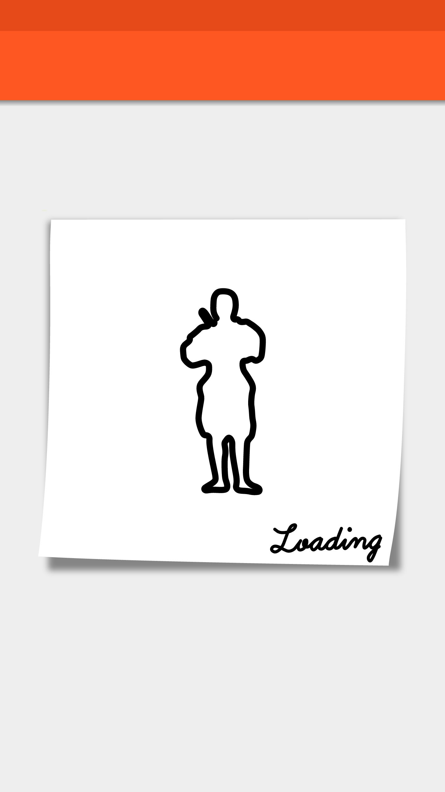|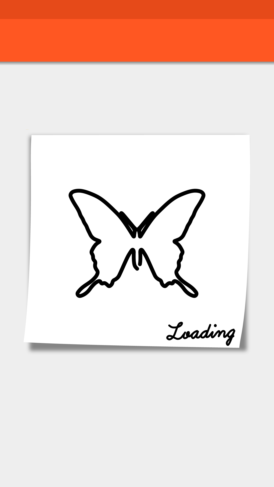|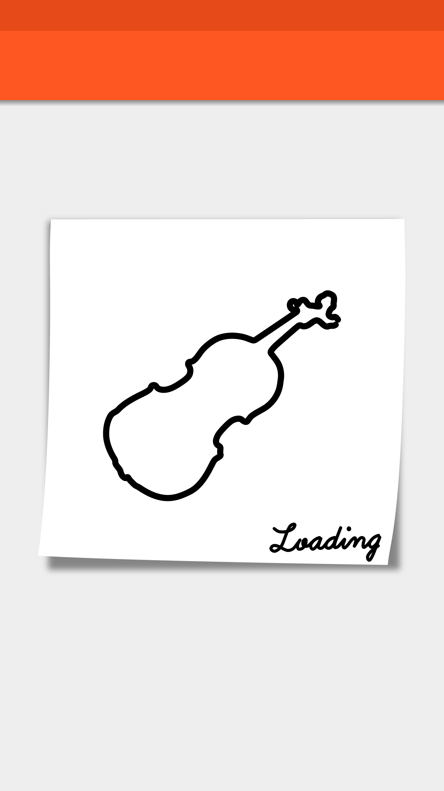|

| RIFLE                               | HEAR STYLE                         | TOOTH                              |
|:------------------------------------|:-----------------------------------|:-----------------------------------|
| 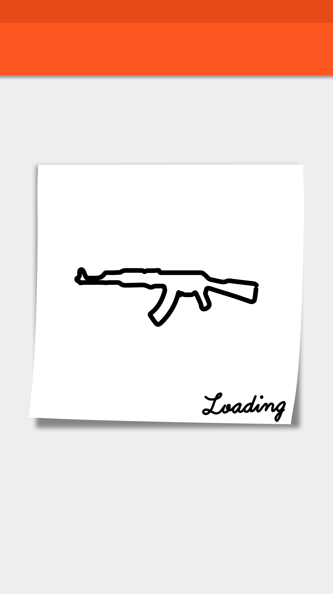|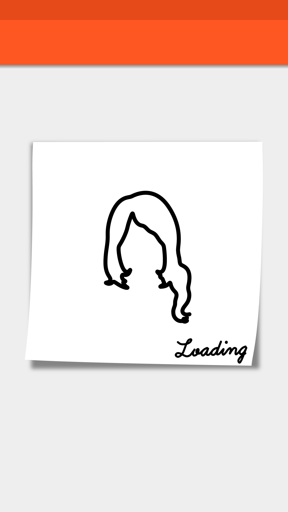||

| CUCUMBER                            | STORM                              | DOGEZA                             |
|:------------------------------------|:-----------------------------------|:-----------------------------------|
| 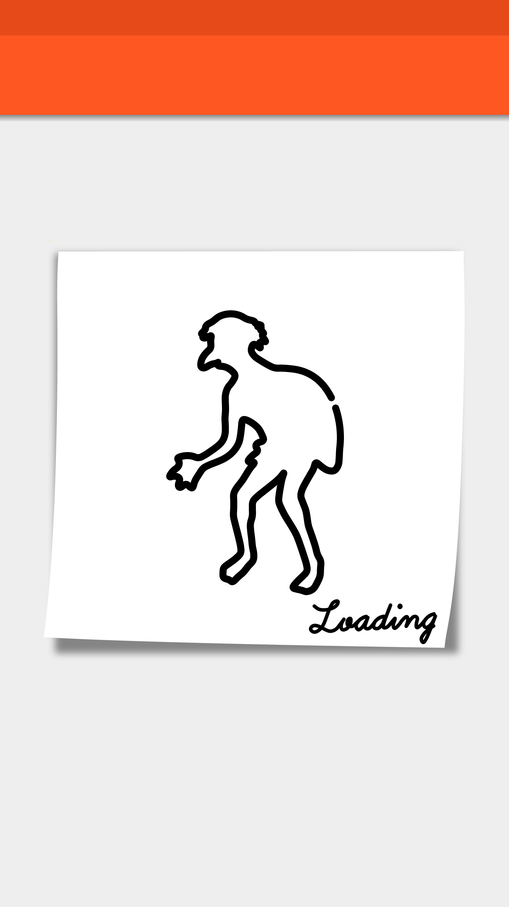|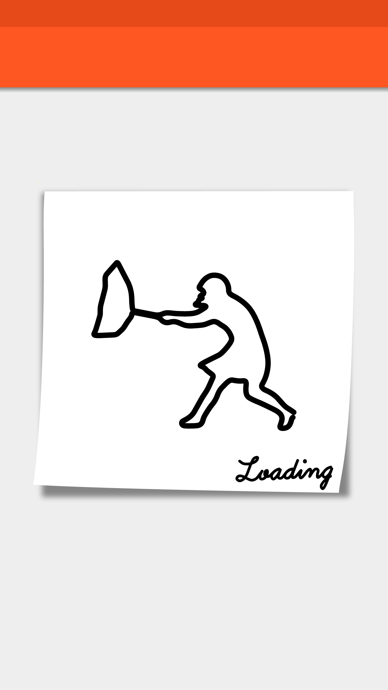|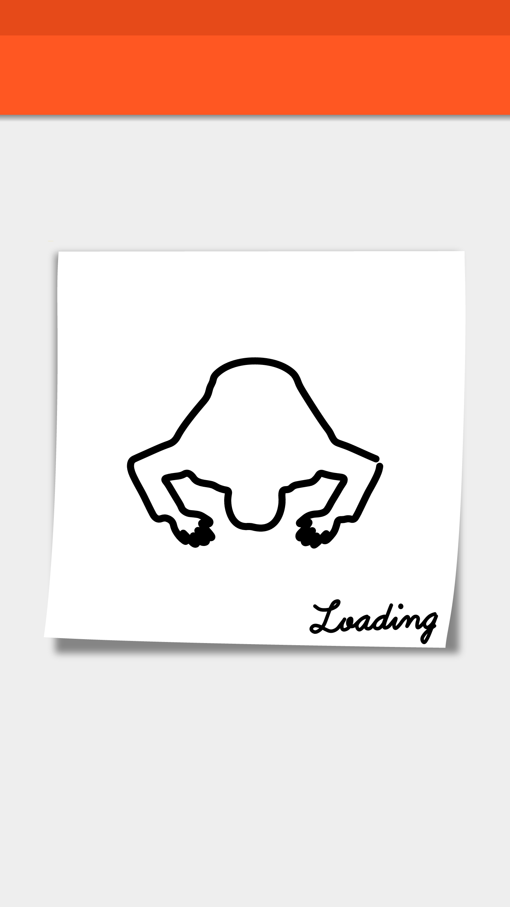|

| CAT                                 |
|:------------------------------------|
| 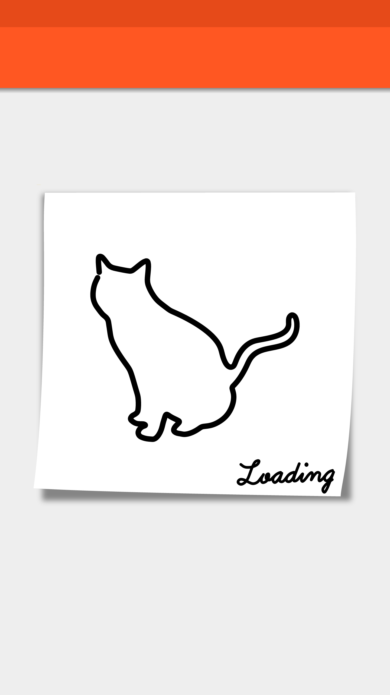|


## Requirements
Target Sdk Version : 21  
Min Sdk Version : 14  

##  How to use
1) Add this to your **build.gradle**.
```java
repositories {
    maven {
        url "https://jitpack.io"
    }
}

dependencies {
  compile 'com.github.recruit-lifestyle:ColoringLoading:1.0'
}
```  

2) Add  ```java jp.co.recruit_lifestyle.android.widget.ColoringLoadingView ```.  
```xml
<jp.co.recruit_lifestyle.android.widget.ColoringLoadingView
    android:layout_width="300dp"
    android:layout_height="300dp"
    />
```  

3) Select Character.  
```java
loadingView.setCharacter(ColoringLoadingView.Character.BUTTERFLY);
```

4) Call ```java ColoringLoadingView#startDrawAnimation```  
```java
loadingView.startDrawAnimation();
```

5) When finished, call setVisibility(GONE)  
```java
loadingView.setVisibility(View.GONE);
```

## Custom
If you need another Character, you can make new Character very easy.  

1) Make 100pt * 100pt Canvas with Illustrator  

2) Draw new Character  


3) Open ExtendScript ToolKit and import <a href="./ConvertScript.jsx">ConvertScript.jsx</a>

4) Select new Character, Run <a href="./ConvertScript.jsx">ConvertScript.jsx</a>  

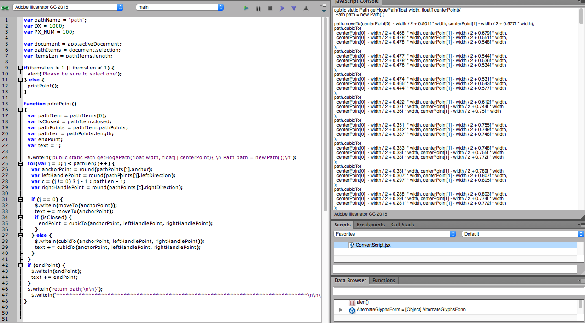  

5) Copy the results outputted to CharacterPath.java  

6) Update <a href="./library/src/main/java/jp/co/recruit_lifestyle/android/widget/ColoringLoadingView.java">ColoringLoadingView.java</a>  
Update Character  
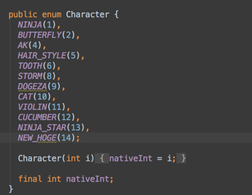  

Add new case and put in CharacterPath variable
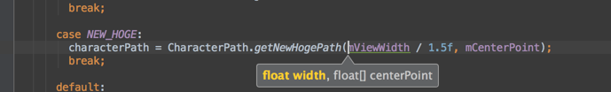  

## Credits

ColoringLoading is owned and maintained by [RECRUIT LIFESTYLE CO., LTD.](http://www.recruit-lifestyle.co.jp/)

ColoringLoading was originally created by [Yuki Mima](https://github.com/amyu)  


## License

    Copyright 2015 RECRUIT LIFESTYLE CO., LTD.

    Licensed under the Apache License, Version 2.0 (the "License");
    you may not use this file except in compliance with the License.
    You may obtain a copy of the License at

       http://www.apache.org/licenses/LICENSE-2.0

    Unless required by applicable law or agreed to in writing, software
    distributed under the License is distributed on an "AS IS" BASIS,
    WITHOUT WARRANTIES OR CONDITIONS OF ANY KIND, either express or implied.
    See the License for the specific language governing permissions and
    limitations under the License.
